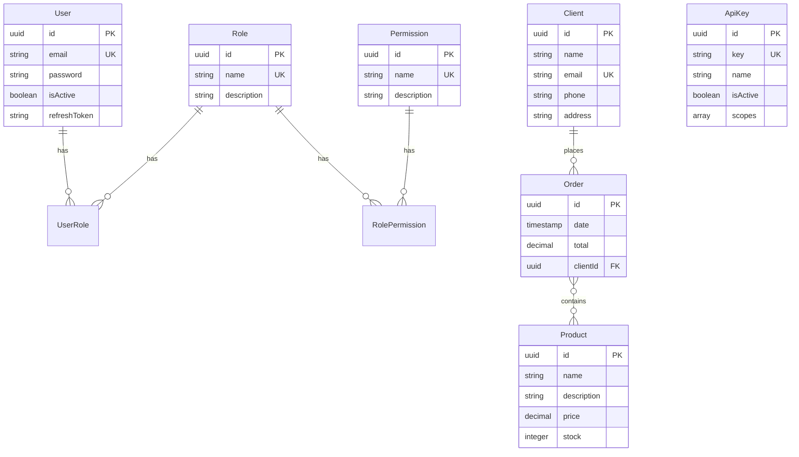

# 📚 Documentación Técnica - Riwi SportsLine API

## Tabla de Contenidos

1. [Visión General](#visión-general)
2. [Arquitectura del Proyecto](#arquitectura-del-proyecto)
3. [Estructura de Carpetas](#estructura-de-carpetas)
4. [Capa de Datos](#capa-de-datos)
5. [Autenticación y Seguridad](#autenticación-y-seguridad)
6. [Middleware y Filtros](#middleware-y-filtros)
7. [Validación y DTOs](#validación-y-dtos)
8. [Decisiones de Diseño](#decisiones-de-diseño)
9. [Flujo de Peticiones](#flujo-de-peticiones)

---

## Visión General

### ¿Qué es este proyecto?

Riwi SportsLine es una API REST para un e-commerce de artículos deportivos, migrada desde Express.js a **NestJS**. La migración se realizó siguiendo las mejores prácticas de NestJS, implementando una arquitectura modular, escalable y mantenible.

### Tecnologías Principales

- **Framework**: NestJS 10.x
- **Lenguaje**: TypeScript
- **ORM**: TypeORM
- **Base de Datos**: PostgreSQL (Dockerizada)
- **Autenticación**: JWT (Access + Refresh Tokens), OAuth2 (Google), API Keys
- **Validación**: class-validator, class-transformer
- **Documentación**: Swagger/OpenAPI

---

## Arquitectura del Proyecto

### Patrón Arquitectónico: Modular + Layered Architecture

NestJS sigue una arquitectura modular inspirada en Angular. Cada funcionalidad está encapsulada en un **módulo** independiente.

```
┌─────────────────────────────────────────────┐
│           HTTP Request (Cliente)            │
└──────────────────┬──────────────────────────┘
                   │
                   ▼
┌─────────────────────────────────────────────┐
│         Middleware (LoggerMiddleware)       │
│  - Logging de peticiones HTTP               │
└──────────────────┬──────────────────────────┘
                   │
                   ▼
┌─────────────────────────────────────────────┐
│         Guards (JwtAuthGuard, RolesGuard)   │
│  - Autenticación JWT                        │
│  - Autorización por roles                   │
└──────────────────┬──────────────────────────┘
                   │
                   ▼
┌─────────────────────────────────────────────┐
│         Interceptors (Timeout, Transform)   │
│  - Timeout de 5 segundos                    │
│  - Transformación de respuestas             │
└──────────────────┬──────────────────────────┘
                   │
                   ▼
┌─────────────────────────────────────────────┐
│         Pipes (ValidationPipe)              │
│  - Validación de DTOs                       │
│  - Transformación de tipos                  │
└──────────────────┬──────────────────────────┘
                   │
                   ▼
┌─────────────────────────────────────────────┐
│              Controller                     │
│  - Manejo de rutas                          │
│  - Validación de parámetros                 │
└──────────────────┬──────────────────────────┘
                   │
                   ▼
┌─────────────────────────────────────────────┐
│               Service                       │
│  - Lógica de negocio                        │
│  - Interacción con repositorios             │
└──────────────────┬──────────────────────────┘
                   │
                   ▼
┌─────────────────────────────────────────────┐
│         Repository (TypeORM)                │
│  - Acceso a base de datos                   │
│  - Queries SQL                              │
└──────────────────┬──────────────────────────┘
                   │
                   ▼
┌─────────────────────────────────────────────┐
│          PostgreSQL Database                │
└─────────────────────────────────────────────┘
```

### ¿Por qué esta arquitectura?

1. **Separación de Responsabilidades**: Cada capa tiene una responsabilidad única y bien definida
2. **Testabilidad**: Cada componente puede ser testeado de forma aislada
3. **Mantenibilidad**: Los cambios en una capa no afectan a las demás
4. **Escalabilidad**: Fácil agregar nuevas funcionalidades sin romper el código existente

---

## Estructura de Carpetas

```
src/
├── api-keys/              # Módulo de API Keys
│   └── entities/
│       └── api-key.entity.ts
├── auth/                  # Módulo de Autenticación
│   ├── dto/
│   │   ├── login.dto.ts
│   │   └── register.dto.ts
│   ├── strategies/
│   │   ├── jwt.strategy.ts
│   │   ├── jwt-refresh.strategy.ts
│   │   ├── api-key.strategy.ts
│   │   └── google.strategy.ts
│   ├── auth.controller.ts
│   ├── auth.service.ts
│   └── auth.module.ts
├── clients/               # Módulo de Clientes
│   ├── dto/
│   ├── entities/
│   │   └── client.entity.ts
│   ├── clients.controller.ts
│   ├── clients.service.ts
│   └── clients.module.ts
├── common/                # Código compartido
│   ├── decorators/
│   │   ├── current-user.decorator.ts
│   │   ├── public.decorator.ts
│   │   └── roles.decorator.ts
│   ├── filters/
│   │   └── http-exception.filter.ts
│   ├── guards/
│   │   ├── jwt-auth.guard.ts
│   │   └── roles.guard.ts
│   ├── interceptors/
│   │   ├── timeout.interceptor.ts
│   │   └── transform.interceptor.ts
│   └── middleware/
│       └── logger.middleware.ts
├── config/                # Configuración
│   └── typeorm.config.ts
├── migrations/            # Migraciones de BD
│   ├── 1764162452421-InitialMigration.ts
│   ├── 1764163206633-AddAuthTables.ts
│   └── 1764163425503-AddApiKeys.ts
├── orders/                # Módulo de Órdenes
├── permissions/           # Módulo de Permisos
├── products/              # Módulo de Productos
├── roles/                 # Módulo de Roles
├── seed/                  # Datos iniciales
│   └── seed.ts
├── users/                 # Módulo de Usuarios
├── app.controller.ts
├── app.module.ts          # Módulo raíz
├── app.service.ts
└── main.ts                # Punto de entrada
```

### ¿Por qué esta estructura?

- **Modularidad**: Cada carpeta representa un módulo funcional independiente
- **Escalabilidad**: Fácil agregar nuevos módulos sin afectar los existentes
- **Convención**: Sigue las convenciones de NestJS y Angular
- **Reutilización**: `common/` contiene código compartido entre módulos

---

## Capa de Datos

### Modelo de Entidades y Relaciones



### Entidades Principales

#### 1. **User Entity** (`users/entities/user.entity.ts`)

```typescript
@Entity('users')
export class User {
  @PrimaryGeneratedColumn('uuid')
  id: string;

  @Column({ type: 'varchar', length: 100, unique: true })
  email: string;

  @Column({ type: 'varchar', length: 100 })
  password: string;

  @Column({ type: 'boolean', default: true })
  isActive: boolean;

  @Column({ type: 'text', nullable: true })
  refreshToken: string;

  @ManyToMany(() => Role, (role) => role.users)
  @JoinTable({ name: 'user_roles' })
  roles: Role[];

  @BeforeInsert()
  @BeforeUpdate()
  async hashPassword() {
    if (this.password && !this.password.startsWith('$2b$')) {
      this.password = await bcrypt.hash(this.password, 10);
    }
  }
}
```

**Decisiones de Diseño:**

- **UUID como PK**: Más seguro que IDs incrementales, evita enumeration attacks
- **Email único**: Constraint a nivel de BD para evitar duplicados
- **Password hashing automático**: Hook `@BeforeInsert/@BeforeUpdate` para hashear contraseñas automáticamente
- **Refresh Token**: Almacenado para validar tokens de refresco
- **Relación Many-to-Many con Roles**: Un usuario puede tener múltiples roles

#### 2. **Order Entity** (`orders/entities/order.entity.ts`)

```typescript
@Entity('orders')
export class Order {
  @PrimaryGeneratedColumn('uuid')
  id: string;

  @Column({ type: 'timestamp', default: () => 'CURRENT_TIMESTAMP' })
  date: Date;

  @Column({ type: 'decimal', precision: 10, scale: 2 })
  total: number;

  @ManyToOne(() => Client, (client) => client.orders)
  client: Client;

  @ManyToMany(() => Product)
  @JoinTable({ name: 'orders_products' })
  products: Product[];
}
```

**Decisiones de Diseño:**

- **ManyToOne con Client**: Una orden pertenece a un cliente
- **ManyToMany con Product**: Una orden puede tener múltiples productos
- **JoinTable**: Crea tabla intermedia `orders_products` automáticamente
- **Total calculado**: Se calcula en el servicio al crear/actualizar la orden

### TypeORM: ¿Por qué?

1. **Type Safety**: TypeScript en toda la capa de datos
2. **Migrations**: Control de versiones de la BD
3. **Active Record vs Data Mapper**: Usamos Data Mapper (Repository Pattern)
4. **Decoradores**: Sintaxis declarativa y limpia
5. **Relaciones automáticas**: TypeORM maneja las relaciones y JOINs

---

## Autenticación y Seguridad

### Sistema de Autenticación Multi-Estrategia

El proyecto implementa **4 estrategias de autenticación**:

#### 1. **JWT Access Token** (`auth/strategies/jwt.strategy.ts`)

```typescript
@Injectable()
export class JwtStrategy extends PassportStrategy(Strategy) {
  constructor(
    private configService: ConfigService,
    @InjectRepository(User)
    private userRepository: Repository<User>,
  ) {
    super({
      jwtFromRequest: ExtractJwt.fromAuthHeaderAsBearerToken(),
      ignoreExpiration: false,
      secretOrKey: configService.get<string>('JWT_SECRET'),
    });
  }

  async validate(payload: any) {
    const user = await this.userRepository.findOne({
      where: { id: payload.sub },
      relations: ['roles', 'roles.permissions'],
    });

    if (!user || !user.isActive) {
      throw new UnauthorizedException();
    }

    return user; // Se inyecta en req.user
  }
}
```

**¿Cómo funciona?**

1. Cliente envía token en header: `Authorization: Bearer <token>`
2. Passport extrae el token y lo valida
3. Si es válido, ejecuta `validate()` que busca el usuario en BD
4. El usuario se inyecta en `req.user` y está disponible en el controller

**¿Por qué JWT?**

- **Stateless**: No requiere almacenar sesiones en el servidor
- **Escalable**: Funciona en arquitecturas distribuidas
- **Estándar**: RFC 7519, ampliamente adoptado
- **Payload personalizable**: Podemos incluir roles, permisos, etc.

#### 2. **JWT Refresh Token** (`auth/strategies/jwt-refresh.strategy.ts`)

```typescript
@Injectable()
export class JwtRefreshStrategy extends PassportStrategy(Strategy, 'jwt-refresh') {
  constructor(
    private configService: ConfigService,
    @InjectRepository(User)
    private userRepository: Repository<User>,
  ) {
    super({
      jwtFromRequest: ExtractJwt.fromAuthHeaderAsBearerToken(),
      secretOrKey: configService.get<string>('JWT_REFRESH_SECRET'),
      passReqToCallback: true, // Para acceder al request
    });
  }

  async validate(req: Request, payload: any) {
    const refreshToken = req.get('Authorization')?.replace('Bearer', '').trim();
    
    const user = await this.userRepository.findOne({
      where: { id: payload.sub },
    });

    // Validar que el refresh token coincida con el almacenado
    if (!user || user.refreshToken !== refreshToken) {
      throw new UnauthorizedException();
    }

    return user;
  }
}
```

**¿Por qué Refresh Tokens?**

- **Seguridad**: Access tokens de corta duración (15min)
- **Experiencia de usuario**: No requiere login constante
- **Revocación**: Podemos invalidar refresh tokens en BD
- **Rotación**: Cada refresh genera un nuevo par de tokens

#### 3. **API Key** (`auth/strategies/api-key.strategy.ts`)

```typescript
@Injectable()
export class ApiKeyStrategy extends PassportStrategy(Strategy, 'api-key') {
  constructor(
    @InjectRepository(ApiKey)
    private apiKeyRepository: Repository<ApiKey>,
  ) {
    super();
  }

  async validate(req: any): Promise<any> {
    const apiKey = req.headers['x-api-key'];
    
    if (!apiKey) {
      throw new UnauthorizedException('API key is missing');
    }

    const key = await this.apiKeyRepository.findOne({
      where: { key: apiKey, isActive: true },
    });

    if (!key) {
      throw new UnauthorizedException('Invalid API key');
    }

    return key;
  }
}
```

**¿Por qué API Keys?**

- **Integraciones**: Para sistemas externos (webhooks, APIs de terceros)
- **Simplicidad**: No requiere flujo OAuth complejo
- **Scopes**: Podemos limitar permisos por API key
- **Revocación fácil**: Desactivar en BD sin cambiar código

#### 4. **Google OAuth2** (`auth/strategies/google.strategy.ts`)

```typescript
@Injectable()
export class GoogleStrategy extends PassportStrategy(Strategy, 'google') {
  constructor(
    private configService: ConfigService,
    @InjectRepository(User)
    private userRepository: Repository<User>,
  ) {
    super({
      clientID: configService.get<string>('GOOGLE_CLIENT_ID'),
      clientSecret: configService.get<string>('GOOGLE_CLIENT_SECRET'),
      callbackURL: configService.get<string>('GOOGLE_CALLBACK_URL'),
      scope: ['email', 'profile'],
    });
  }

  async validate(accessToken: string, refreshToken: string, profile: any) {
    const email = profile.emails[0].value;

    let user = await this.userRepository.findOne({ where: { email } });

    if (!user) {
      // Crear usuario automáticamente
      user = this.userRepository.create({
        email,
        password: Math.random().toString(36), // Password aleatorio
        isActive: true,
      });
      await this.userRepository.save(user);
    }

    return user;
  }
}
```

**¿Por qué OAuth2?**

- **Experiencia de usuario**: Login con Google en 1 click
- **Seguridad**: No manejamos contraseñas de usuarios
- **Confianza**: Los usuarios confían en Google
- **Datos verificados**: Email verificado por Google

### Guards: Control de Acceso

#### **JwtAuthGuard** (`common/guards/jwt-auth.guard.ts`)

```typescript
@Injectable()
export class JwtAuthGuard extends AuthGuard('jwt') {
  constructor(private reflector: Reflector) {
    super();
  }

  canActivate(context: ExecutionContext) {
    // Verificar si la ruta es pública
    const isPublic = this.reflector.getAllAndOverride<boolean>(IS_PUBLIC_KEY, [
      context.getHandler(),
      context.getClass(),
    ]);
    
    if (isPublic) {
      return true; // Permitir acceso sin autenticación
    }
    
    return super.canActivate(context); // Validar JWT
  }
}
```

**¿Cómo se usa?**

```typescript
// Ruta pública
@Public()
@Post('login')
login() { ... }

// Ruta protegida (por defecto)
@Get('profile')
getProfile() { ... }
```

#### **RolesGuard** (`common/guards/roles.guard.ts`)

```typescript
@Injectable()
export class RolesGuard implements CanActivate {
  constructor(private reflector: Reflector) {}

  canActivate(context: ExecutionContext): boolean {
    const requiredRoles = this.reflector.getAllAndOverride<string[]>(ROLES_KEY, [
      context.getHandler(),
      context.getClass(),
    ]);
    
    if (!requiredRoles) {
      return true; // Sin restricción de roles
    }
    
    const { user } = context.switchToHttp().getRequest();
    
    // Verificar si el usuario tiene alguno de los roles requeridos
    return requiredRoles.some((role) => 
      user.roles?.some((userRole: any) => userRole.name === role)
    );
  }
}
```

**¿Cómo se usa?**

```typescript
@Roles('admin', 'manager')
@Delete(':id')
deleteProduct() { ... }
```

---

## Middleware y Filtros

### LoggerMiddleware (`common/middleware/logger.middleware.ts`)

```typescript
@Injectable()
export class LoggerMiddleware implements NestMiddleware {
  private logger = new Logger('HTTP');

  use(req: Request, res: Response, next: NextFunction) {
    const { method, originalUrl } = req;
    const start = Date.now();

    res.on('finish', () => {
      const { statusCode } = res;
      const duration = Date.now() - start;

      this.logger.log(
        `${method} ${originalUrl} ${statusCode} - ${duration}ms`,
      );
    });

    next();
  }
}
```

**¿Por qué?**

- **Observabilidad**: Registro de todas las peticiones HTTP
- **Debugging**: Facilita encontrar problemas
- **Métricas**: Duración de peticiones
- **Auditoría**: Registro de accesos

### HttpExceptionFilter (`common/filters/http-exception.filter.ts`)

```typescript
@Catch()
export class HttpExceptionFilter implements ExceptionFilter {
  private logger = new Logger('ExceptionFilter');

  catch(exception: unknown, host: ArgumentsHost) {
    const ctx = host.switchToHttp();
    const response = ctx.getResponse<Response>();
    const request = ctx.getRequest<Request>();

    const status = exception instanceof HttpException
      ? exception.getStatus()
      : HttpStatus.INTERNAL_SERVER_ERROR;

    const message = exception instanceof HttpException
      ? exception.getResponse()
      : 'Internal server error';

    this.logger.error(`Http Status: ${status} Error Message: ${JSON.stringify(message)}`);

    response.status(status).json({
      statusCode: status,
      timestamp: new Date().toISOString(),
      path: request.url,
      message,
    });
  }
}
```

**¿Por qué?**

- **Consistencia**: Todas las respuestas de error tienen el mismo formato
- **Información útil**: Timestamp, path, mensaje
- **Logging**: Registro automático de errores
- **Seguridad**: No expone stack traces en producción

---

## Validación y DTOs

### ¿Qué son los DTOs?

**DTO** = Data Transfer Object. Son clases que definen la forma de los datos que se transfieren entre cliente y servidor.

### Ejemplo: CreateProductDto

```typescript
export class CreateProductDto {
  @ApiProperty({ example: 'Nike Air Max', description: 'Product name' })
  @IsString()
  @IsNotEmpty()
  name: string;

  @ApiProperty({ example: 'Comfortable running shoes', required: false })
  @IsString()
  @IsOptional()
  description?: string;

  @ApiProperty({ example: 99.99, description: 'Product price' })
  @IsNumber()
  @IsPositive()
  price: number;

  @ApiProperty({ example: 50, description: 'Available stock' })
  @IsInt()
  @Min(0)
  stock: number;
}
```

**¿Por qué DTOs?**

1. **Validación automática**: `class-validator` valida los datos antes de llegar al controller
2. **Type Safety**: TypeScript garantiza tipos correctos
3. **Documentación**: `@ApiProperty` genera documentación Swagger automáticamente
4. **Seguridad**: `whitelist: true` elimina propiedades no definidas
5. **Transformación**: Convierte strings a números, etc.

### ValidationPipe Global

```typescript
// main.ts
app.useGlobalPipes(
  new ValidationPipe({
    whitelist: true,           // Elimina propiedades no definidas en DTO
    forbidNonWhitelisted: true, // Lanza error si hay propiedades extra
    transform: true,            // Transforma tipos automáticamente
  }),
);
```

**Flujo de Validación:**

```
1. Cliente envía JSON
2. ValidationPipe transforma JSON a DTO
3. class-validator valida cada propiedad
4. Si hay errores, lanza BadRequestException
5. Si es válido, pasa al controller
```

---

## Decisiones de Diseño

### 1. **¿Por qué NestJS en lugar de Express?**

| Aspecto | Express | NestJS |
|---------|---------|--------|
| **Arquitectura** | Minimalista, sin opinión | Modular, opinionada |
| **TypeScript** | Opcional | First-class citizen |
| **Dependency Injection** | Manual | Built-in |
| **Testing** | Configuración manual | Built-in testing utilities |
| **Escalabilidad** | Requiere disciplina | Estructura forzada |
| **Documentación** | Swagger manual | Decoradores automáticos |

**Conclusión**: NestJS es mejor para proyectos grandes y equipos, Express para proyectos pequeños y rápidos.

### 2. **¿Por qué TypeORM?**

- **Type Safety**: Errores en tiempo de compilación
- **Migrations**: Control de versiones de BD
- **Relaciones**: Manejo automático de JOINs
- **Decoradores**: Sintaxis limpia y declarativa
- **Active Record vs Repository**: Flexibilidad

**Alternativas consideradas**: Prisma (más moderno pero menos maduro), Sequelize (menos type-safe)

### 3. **¿Por qué PostgreSQL?**

- **ACID**: Transacciones confiables
- **Relaciones**: Excelente soporte para FK y constraints
- **JSON**: Soporte nativo para datos semi-estructurados
- **Escalabilidad**: Horizontal y vertical
- **Open Source**: Sin costos de licencia

### 4. **¿Por qué Docker para la BD?**

- **Consistencia**: Mismo ambiente en dev, staging, prod
- **Aislamiento**: No contamina el sistema local
- **Portabilidad**: Funciona en cualquier OS
- **Versionado**: docker-compose.yml en git

### 5. **¿Por qué Swagger?**

- **Auto-generado**: Decoradores generan docs automáticamente
- **Interactivo**: Probar endpoints desde el navegador
- **Estándar**: OpenAPI es el estándar de la industria
- **Sincronizado**: Siempre actualizado con el código

---

## Flujo de Peticiones

### Ejemplo: Crear una Orden

```
1. Cliente → POST /api/orders
   Body: { clientId: "uuid", productIds: ["uuid1", "uuid2"] }

2. LoggerMiddleware
   → Log: "POST /api/orders"

3. JwtAuthGuard
   → Extrae token del header
   → Valida con JwtStrategy
   → Inyecta user en req.user

4. ValidationPipe
   → Transforma body a CreateOrderDto
   → Valida con class-validator
   → Si hay errores → 400 Bad Request

5. OrdersController.create()
   → Recibe CreateOrderDto validado
   → Llama a OrdersService.create()

6. OrdersService.create()
   → Busca Client por clientId
   → Busca Products por productIds
   → Calcula total
   → Crea Order
   → Guarda en BD

7. HttpExceptionFilter (si hay error)
   → Formatea error
   → Log error
   → Retorna JSON consistente

8. Response → Cliente
   → 201 Created
   → Body: Order creada con relaciones
```

---

## Mejores Prácticas Implementadas

### 1. **Separation of Concerns**
- Controllers: Solo routing y validación
- Services: Lógica de negocio
- Repositories: Acceso a datos

### 2. **Dependency Injection**
- Todo se inyecta, nada se instancia con `new`
- Facilita testing con mocks

### 3. **Error Handling**
- Excepciones tipadas (`NotFoundException`, `UnauthorizedException`)
- Filtro global para consistencia

### 4. **Security**
- Passwords hasheados con bcrypt
- JWT con expiración
- Refresh tokens rotados
- CORS configurado
- Helmet (recomendado para producción)

### 5. **Validation**
- DTOs con class-validator
- ValidationPipe global
- Whitelist para seguridad

### 6. **Documentation**
- Swagger con decoradores
- Comentarios en código
- README actualizado

### 7. **Database**
- Migrations para control de versiones
- Seeds para datos iniciales
- Relaciones bien definidas

---

## Próximos Pasos (Recomendaciones)

### 1. **Testing**
```typescript
// products.service.spec.ts
describe('ProductsService', () => {
  let service: ProductsService;
  let repository: Repository<Product>;

  beforeEach(async () => {
    const module = await Test.createTestingModule({
      providers: [
        ProductsService,
        {
          provide: getRepositoryToken(Product),
          useValue: mockRepository,
        },
      ],
    }).compile();

    service = module.get<ProductsService>(ProductsService);
  });

  it('should create a product', async () => {
    // Test implementation
  });
});
```

### 2. **Caching**
```typescript
// Redis para cache
@Injectable()
export class ProductsService {
  @Cacheable({ ttl: 60 })
  async findAll() {
    return this.productRepository.find();
  }
}
```

### 3. **Rate Limiting**
```typescript
// Throttler para limitar requests
@Module({
  imports: [
    ThrottlerModule.forRoot({
      ttl: 60,
      limit: 10,
    }),
  ],
})
```

### 4. **Logging Avanzado**
```typescript
// Winston para logs estructurados
import { WinstonModule } from 'nest-winston';
```

### 5. **Monitoreo**
- Prometheus + Grafana
- Sentry para error tracking
- New Relic / DataDog

---

## Conclusión

Este proyecto implementa una arquitectura robusta, escalable y mantenible siguiendo las mejores prácticas de NestJS. Cada decisión de diseño está justificada y orientada a:

- **Seguridad**: Múltiples capas de autenticación y validación
- **Escalabilidad**: Arquitectura modular y stateless
- **Mantenibilidad**: Código limpio, tipado y documentado
- **Developer Experience**: Swagger, TypeScript, decoradores

La migración de Express a NestJS proporciona una base sólida para el crecimiento futuro del proyecto.
